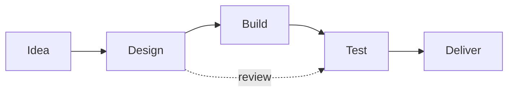

---
layout: cover
class: text-white
background: https://images.unsplash.com/photo-1500530855697-b586d89ba3ee?q=80&w=1600&auto=format&fit=crop
---

# Polished Example Deck

Beautiful, clean, and practical Slidev examples

<div class="text-xl opacity-90">UX-first patterns, animations, and layouts</div>

<div class="mt-8 flex gap-3">
  <span class="px-3 py-1 rounded-full bg-white/20">Slidev</span>
  <span class="px-3 py-1 rounded-full bg-white/20">Mermaid</span>
  <span class="px-3 py-1 rounded-full bg-white/20">Code</span>
</div>

<!-- Keep the cover minimal and readable -->

---
layout: two-cols
---

# Agenda

- Vision and design principles
- UI patterns you can reuse
- Code & diagrams
- Tips and resources

::right::

<div class="p-5 rounded-xl bg-primary/10 dark:bg-white/5 border border-primary/20">
  <div class="text-lg font-600 mb-2">What you’ll get</div>
  <ul class="list-disc pl-5 space-y-1">
    <li>Ready-to-copy layouts</li>
    <li>Progressive reveals</li>
    <li>Accessible color choices</li>
  </ul>
</div>

<!-- Notes: Call out that everything here is copy-paste friendly. -->

---
class: px-8
---

# Design principles

- Clarity over cleverness
- Consistent spacing and typography
- Contrast for readability
- Motion as a hint, not a distraction

<v-clicks>
- Keep slides focused: one idea per slide
- Prefer short lines (45–75 chars)
</v-clicks>

---
layout: two-cols
class: items-stretch
---

## Reusable UI patterns

- Cards on a grid
- Emphasis blocks
- Inline stats

<div class="grid grid-cols-3 gap-4 mt-6">
  <div class="p-4 rounded-xl bg-white/70 dark:bg-black/40 shadow backdrop-blur">
    <div class="text-sm opacity-70">Time to build</div>
    <div class="text-2xl font-700">~5 min</div>
  </div>
  <div class="p-4 rounded-xl bg-white/70 dark:bg-black/40 shadow backdrop-blur">
    <div class="text-sm opacity-70">Reusable pieces</div>
    <div class="text-2xl font-700">8+</div>
  </div>
  <div class="p-4 rounded-xl bg-white/70 dark:bg-black/40 shadow backdrop-blur">
    <div class="text-sm opacity-70">Audience rating</div>
    <div class="text-2xl font-700">4.9/5</div>
  </div>
</div>

::right::

> Tip: Use subtle elevation (shadow, blur) and soft borders for depth.

<!-- Notes: Explain why soft backgrounds and rounded corners improve readability. -->

---

## Code with highlights

```ts {1,3-4}
// Minimal example
export const greet = (name: string) => `Hello, ${name}!`

console.log(greet('Slidev'))
```

- Keep examples short and runnable
- Use line highlighting to focus attention

---

## Diagram: flow overview



- Visuals explain sequences faster than text

---
layout: two-cols
---

## Split narrative

- Use two columns to balance text and visuals
- Right column can contain images or code

::right::


---

## Progressive reveal

<v-clicks>
- Start simple
- Add details when relevant
- Avoid overwhelming the audience
</v-clicks>

---
class: px-10
---

## Callouts and emphasis

<div class="p-5 rounded-xl bg-amber/15 border border-amber/30">
  <strong>Heads up</strong>: Use warm tones for warnings and cool tones for info.
</div>

<div class="mt-4 p-5 rounded-xl bg-sky/15 border border-sky/30">
  <strong>Info</strong>: Keep contrast sufficient for accessibility.
</div>

---
layout: center
class: text-center
---

# Thanks!

Questions?

<div class="opacity-70 mt-2">Slides made with Slidev — clean, fast, and flexible</div>

<!-- Notes: Invite questions and share repo or contact if applicable. -->
